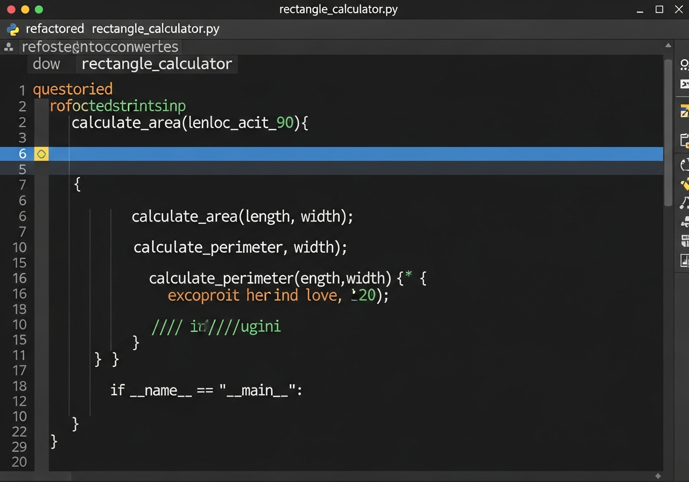

# Exercise 01: Basic Usage - Refactoring a Python Script

## Objective

In this exercise, you will use the Gemini CLI to refactor a simple, poorly written Python script. This will help you understand how to leverage Gemini for improving code quality.

## Scenario

You've been given a Python script that calculates the area and perimeter of a rectangle. The script works, but it's not very readable, uses global variables unnecessarily, and could benefit from function encapsulation.

Your task is to use Gemini to refactor this script into a cleaner, more modular version.

## Instructions

1.  **Examine the initial script:**
    Create a file `practice/rectangle_calculator.py` with the following content:
    ```python
    # practice/rectangle_calculator.py
    
    length = 10
    width = 5
    
    area = length * width
    perimeter = 2 * (length + width)
    
    print("Area:", area)
    print("Perimeter:", perimeter)
    ```

2.  **Use Gemini to refactor the script:**
    Formulate a prompt for Gemini that asks it to refactor `practice/rectangle_calculator.py`. Your prompt should aim to:
    *   Encapsulate the area and perimeter calculations into functions.
    *   Remove global variables and pass `length` and `width` as function arguments.
    *   Add a main execution block (`if __name__ == "__main__":`).

    Example prompt idea:
    ```bash
    gemini 'In the file `practice/rectangle_calculator.py`, refactor the script to use functions for calculating area and perimeter. The functions should be named calculate_area and calculate_perimeter, and should accept length and width as arguments. Also, add a main execution block (`if __name__ == "__main__":`) to call these functions and print the results.'
    ```

3.  **Review Gemini's output:**
    Inspect the modified `practice/rectangle_calculator.py` file after Gemini has processed it. Does it meet the objectives?

4.  **Test the refactored script:**
    Run the refactored script to ensure it still produces the correct output:
    ```bash
    python practice/rectangle_calculator.py
    ```

## Expected Outcome (Example)

After refactoring, your `practice/rectangle_calculator.py` might look something like this:



```python
def calculate_area(length, width):
    return length * width

def calculate_perimeter(length, width):
    return 2 * (length + width)

if __name__ == "__main__":
    length = 10
    width = 5

    area = calculate_area(length, width)
    perimeter = calculate_perimeter(length, width)

    print("Area:", area)
    print("Perimeter:", perimeter)
```

## Troubleshooting Tips

*   If Gemini's output isn't quite right, try refining your prompt to be more specific. Mentioning the specific file path and function names helps Gemini focus.
*   If Gemini fails to edit the file, try asking it to "Output the full corrected code" and then manually copy it.

Good luck!