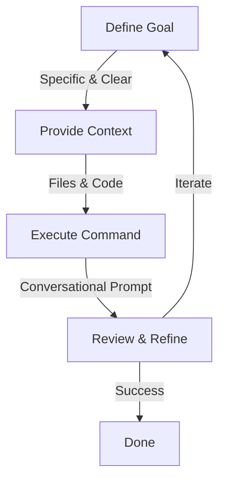

# 01 - Introduction to Gemini CLI Capabilities

This module expands on the foundational concepts introduced in `GETTING_STARTED.md`, providing a deeper dive into the core capabilities and interaction patterns of the Gemini CLI.

## Understanding Gemini's Role

The Gemini CLI is designed to be an intelligent coding partner. It can assist with a variety of tasks, including:

*   **Code Generation:** Writing new functions, classes, or even entire scripts based on your natural language prompts.
*   **Code Refactoring:** Improving existing code for readability, performance, or adherence to best practices.
*   **Debugging Assistance:** Helping identify and suggest fixes for bugs in your code.
*   **Code Explanation:** Providing clear explanations for complex code snippets.
*   **Test Generation:** Creating unit tests for your functions or modules.

## The Prompt is the API

One of the most powerful aspects of the Gemini CLI is its unified interface. Unlike traditional command-line tools that require you to learn dozens of specific flags and subcommands, Gemini uses **Natural Language as its API**.

*   **Unified Entry Point:** You don't need to remember if it's `gemini generate` or `gemini create`. You just tell Gemini what you want.
*   **Contextual Flexibility:** You can combine multiple requests into a single prompt (e.g., "Refactor this function *and* add unit tests").
*   **Intuitive Discovery:** Instead of digging through help pages, you can often just ask Gemini what it's capable of or how to perform a task.

This shift means that **Prompt Engineering**—the art of crafting clear, specific, and contextual requests—is now your primary technical skill for mastering this tool.

## Key Interaction Patterns

Interacting with Gemini typically involves the following steps, which can be visualized as a cycle:



1.  **Define Your Goal:** Clearly articulate what you want Gemini to do. The more specific your prompt, the better the result.
2.  **Provide Context:** If Gemini needs to operate on existing code, make sure to provide the relevant files or code snippets.
3.  **Execute the Command:** Use the `gemini` command followed by your detailed, conversational prompt.
    ```bash
    gemini "Your detailed request here, mentioning files and desired actions."
    ```
4.  **Review and Refine:** Always review Gemini's output. It might be perfect, or it might require slight adjustments from you, or a follow-up prompt to iterate on the changes.

## Crafting Effective Prompts

The quality of Gemini's output heavily depends on the quality of your input. Here are some tips for crafting effective prompts:

*   **Be Specific:** Instead of "write a function," try "write a Python function named `calculate_area` that takes `length` and `width` as arguments and returns their product."
*   **Specify Language/Framework:** Clearly state the programming language, framework, or library you are working with.
*   **Provide Constraints:** Mention any constraints or requirements, such as "make it efficient," "handle edge cases for negative numbers," or "follow PEP 8 style guidelines."
*   **Example-Based Prompting:** Sometimes, providing an example of desired input/output can be very effective.

## Next Steps

Head over to the exercises to put these concepts into practice!
*   **[Exercise 01: Basic Usage](../exercises/01-basic-usage/README.md)**