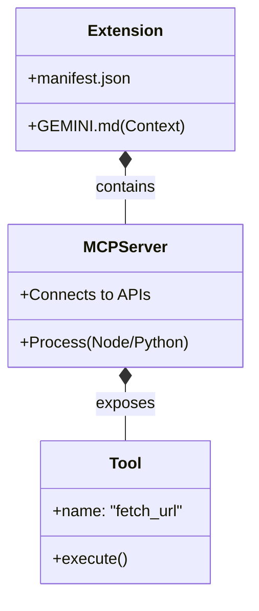

# 04 - Extensions Overview: Expanding Gemini's Capabilities

This module introduces **Gemini Extensions**. Extensions are the mechanism for adding new capabilities, tools, and workflows to the Gemini CLI. They allow Gemini to interact with external systems, APIs, and your local environment in ways that the base model cannot.

## Terminology: The Anatomy of a Capability

It's easy to confuse these terms. Here is the hierarchy:

1.  **Extension:** The installable package (the "Box").
2.  **MCP Server:** The backend process running inside the extension (the "Engine").
3.  **Tools:** The specific functions the AI can call (the "Features").

### Protocol vs. Product
*   **MCP (Model Context Protocol):** The open standard (JSON-RPC) for how the AI talks to the server.
*   **Gemini CLI:** The client that speaks this protocol.

## Why Extensions?
## What is an Extension?

An Extension is a package that enhances Gemini with:
1.  **Tools:** New functions Gemini can execute (like generating images, querying a database, or rendering diagrams).
2.  **Context:** Persistent instructions (`GEMINI.md`) specific to that extension.
3.  **Commands:** Custom shortcuts.

Think of Extensions like browser plugins. They transform Gemini from a text generator into a versatile automation platform.

## How Extensions Work

When you install an extension, Gemini gains access to its **Tools**. When you ask Gemini to do something (e.g., "Create a logo"), it checks its available tools to see if any of them can fulfill your request.

*   **Intent Recognition:** Gemini analyzes your prompt.
*   **Tool Selection:** If your prompt matches a tool's capability (e.g., the `generate_image` tool from an Asset Generator extension), Gemini selects it.
*   **Execution:** Gemini runs the tool and returns the result (the image).

## Under the Hood: How It Works

For the technically curious, Gemini uses the **Model Context Protocol (MCP)** to standardize these interactions.

1.  **Discovery:** When Gemini starts, it reads the `gemini-extension.json` manifests of all installed extensions. It builds a catalog of available tools (e.g., `asset-generator:generate_image`, `database:query`).
2.  **Context Injection:** A condensed list of these tools (names and descriptions) is invisibly injected into the system prompt. This tells the LLM, "You have these tools available."
3.  **The Handshake:** When you ask for an image, the LLM outputs a structured "Tool Call" request instead of plain text.
4.  **The Bridge:** The Gemini CLI intercepts this request, runs the corresponding code in the Extension (which runs as a separate process), and feeds the result back to the LLM.
5.  **Security & Privacy:** You have full control over what capabilities your AI has access to. There are two primary types of connections:
    *   **Local Tools:** Most extensions run as local processes on your machine. Your data stays in your environment, and the tools have the same permissions as your user.
    *   **Remote Tools:** Gemini can also connect to remote MCP servers via a URL (using SSE). In this case, relevant context may be sent to the remote service to perform the requested action. Always verify the trustworthiness of remote MCP providers.

## Local vs. Remote MCP

Depending on your use case, you might choose to run an MCP server locally or connect to a hosted service.

| Feature | Local (stdio) | Remote (SSE/URL) |
| :--- | :--- | :--- |
| **Privacy** | High (Data stays on your machine) | Variable (Data sent to provider) |
| **Setup** | Requires local runtime (Node/Python) | Just a URL |
| **Resources** | Uses your local CPU/RAM | Uses remote server resources |
| **Access** | Can access your local file system | Restricted to provided API |
| **Reliability** | Works offline | Requires internet connection |

## Common Use Cases

Extensions transform Gemini from a chatbot into a specialized workstation:

*   **Data Retrieval:** Fetching live data from GitHub, Jira, or internal databases.
*   **Asset Generation:** Creating images, diagrams, or PDFs directly from prompts.
*   **System Automation:** Running shell commands, managing files, or triggering CI/CD pipelines.
*   **Browser Interaction:** Navigating websites, taking screenshots, and extracting data from web apps.

## Pros and Cons of Extensions

### Pros
*   **Endless Capability:** Gemini can do anything a program can do.
*   **Reduced Hallucination:** By providing real data (e.g., from an API), Gemini doesn't have to guess facts.
*   **Standardized Integration:** MCP makes it easy to swap tools between different AI clients.

### Cons
*   **Complexity:** Setting up MCP servers requires technical knowledge (Node/Python).
*   **Security Risk:** A malicious extension could read your files or execute harmful commands if not vetted.
*   **Latency:** Every tool call adds a small delay to the response time.

## Example: The Asset Generator

We've used an extension already! When we generated the logo for this repository, we were using an extension that provided an `asset-generator` tool.

*   **You asked:** "Generate a logo..."
*   **Gemini thought:** "I have a tool that generates images. I will use it."
*   **Gemini executed:** The tool created `logo.png`.

## Managing Extensions

You can manage extensions using the `gemini extensions` command group.

*   `gemini extensions list`: See what you have installed.
*   `gemini extensions add <path>`: Install a local extension.
*   `gemini extensions remove <name>`: Uninstall an extension.

## Next Steps

In the next exercise, you will use an installed extension to perform a task. Later, in Module 05, you will learn how to build your own!
*   **[Exercise 04: Using an Extension](../exercises/04-using-extensions/README.md)**